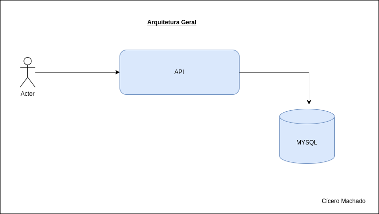
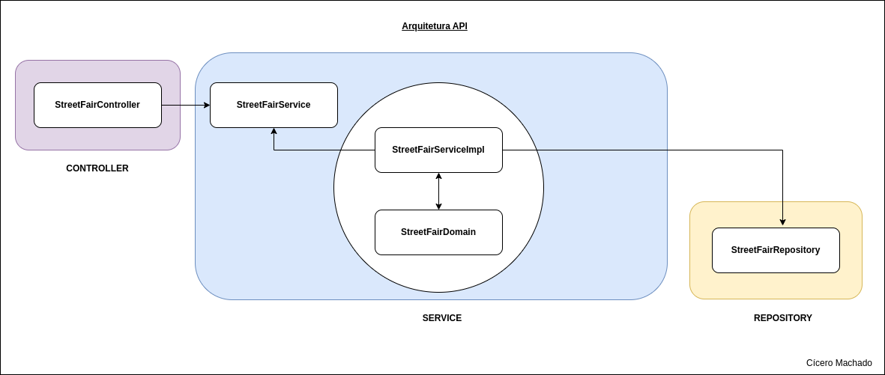
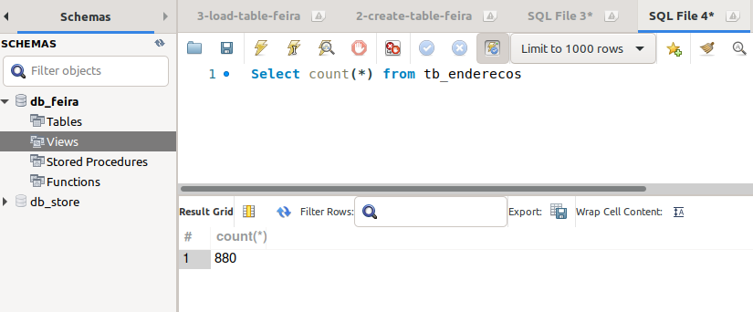
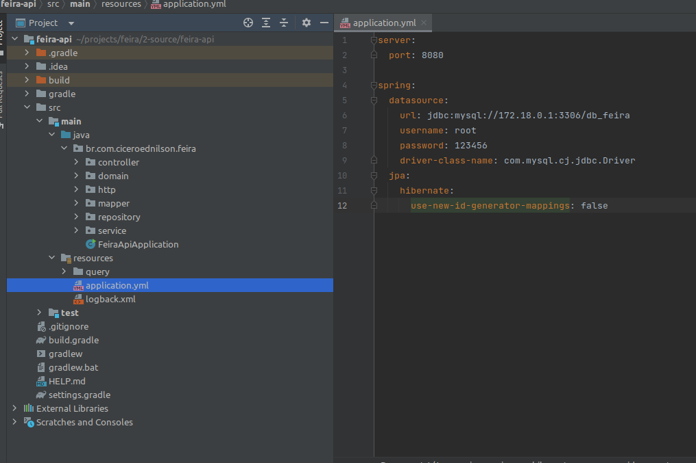
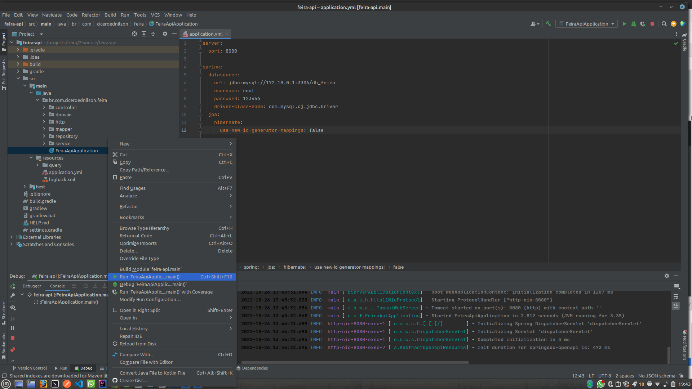
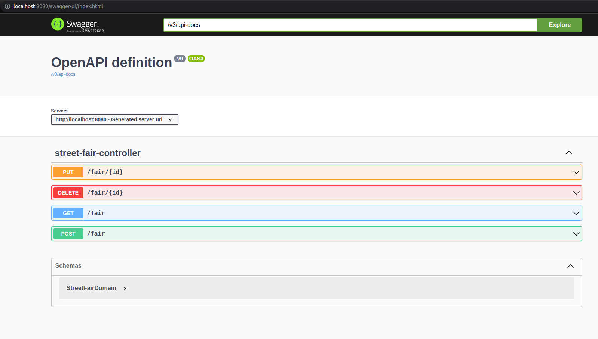
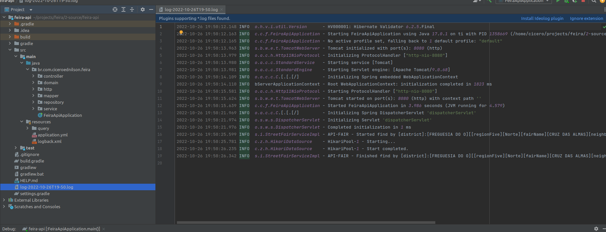
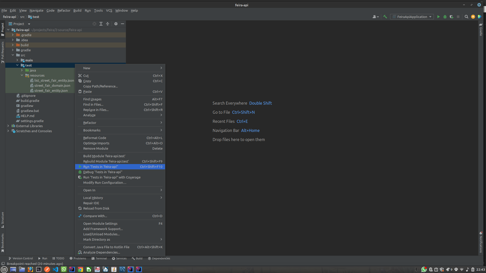
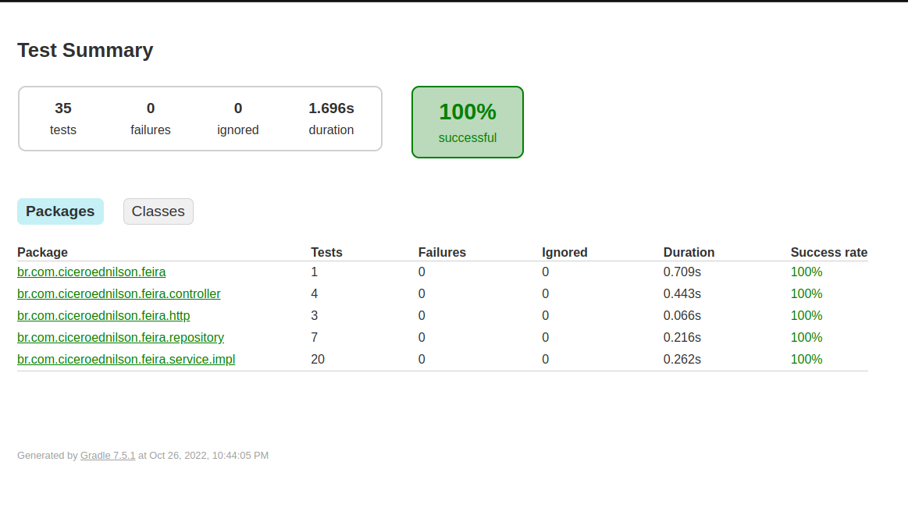
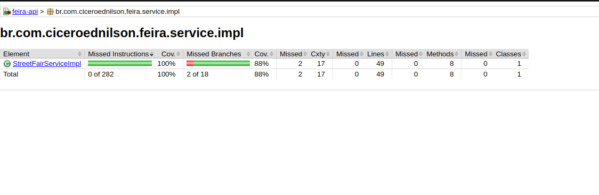

# API PARA CRUD DE FEIRAS DE RUA

Api desenvolvida em Java e Banco de Dados Mysql.

## ⚙️ Código fonte

 * [fontes/feira-api](fontes/feira-api)

## 🚀 Começando

Essa api tem o objetivo, de servir todo um fluxo de controle de cadastro das feiras de São Paulo.   

## 🛠 Ferramentas e Tecnologia usadas no projeto

<ol>
  <li>Java</li>
  <li>Intellij</li>
  <li>Postman</li>
  <li>Mysql</li>
  <li>Mysql Workbench</li>
  <li>Open API</li>
  <li>Junit</li>
  <li>Mockito</li>
  <li>Jacoco</li>
  <li>Gradle</li>
  <li>Docker</li>
</ol>

## 📋 Pré-requisitos

Abaixo podemos ver as ferramentas necessárias para executar e testar o projeto.

<ol>
  <li>Java</li>
  <li>Intellij</li>
  <li>Postman</li>
  <li>Mysql</li>
  <li>Mysql Workbench</li>
  <li>Docker</li>
</ol>

Usei o Docker para instalação do Msql, mas você pode instalar ele direto no seu Sistema Operacional.

##  🔧 Instalação

[Java](https://www.oracle.com/java/technologies/javase/jdk17-archive-downloads.html)

[Intellij](https://www.jetbrains.com/idea/download/#section=linux)

[Postman](https://www.postman.com/downloads/)

[Mysql (Docker)](https://hub.docker.com/_/mysql)

[Mysql Workbench](https://www.mysql.com/products/workbench/)

[Docker](https://docs.docker.com/engine/install/ubuntu/)

## ⚙️ Arquitetura do projeto

## ⚙️ Arquitetura da API

## ⚙️ Criando Banco de Dados

Você pode usar o script **1-create-data-base.sql** que estã na pasta script, ou pode apenas executar o comando abaixo.

~~~~sql
CREATE SCHEMA `db_feira` ;
~~~~

## ⚙️ Criando a tabela

Para criar a tabela que vamos usar nesse projeto, você pode pegar o script **2-create-table-feira.sql** que está na pasta script, ou pode apenas executar o comando abaixo.

~~~~sql
CREATE TABLE IF NOT EXISTS tb_enderecos(
   `id` 		   INT NOT NULL PRIMARY KEY AUTO_INCREMENT,
   `long` 	       BIGINT NOT NULL,
   `lat` 		   BIGINT NOT NULL,
   `setcens`       BIGINT NOT NULL,
   `areap`         BIGINT NOT NULL,
   `coddist`       TINYINT NOT NULL,
   `distrito`      VARCHAR(250) NOT NULL,
   `codsubpref`    TINYINT NOT NULL,
   `subprefe`      VARCHAR(250) NOT NULL,
   `regiao5`       VARCHAR(50) NOT NULL,
   `regiao8`       VARCHAR(50) NOT NULL,
   `nome_feira`    varchar(250) NOT NULL,
   `registro`      CHAR(6) NOT NULL,
   `logradouro`    varchar(250) NOT NULL,   
   `numero`        VARCHAR(50) NULL,
   `bairro`        VARCHAR(100) NOT NULL,
   `referencia`    VARCHAR(250) NOT NULL
);
~~~~

## ⚙️ Importando o arquivo que contem os endereços das feiras.

O arquivo se encontra na pasta csv com o nome de **DEINFO_AB_FEIRASLIVRES_2014.csv**.

Para importar o arquivo você precisa mudar o caminho no script, pode pegar o mesmo na pasta pasta script com o nome **3-load-table-feira.sql** ou pegar abaixo.

~~~~sql
TRUNCATE TABLE tb_enderecos;

ALTER TABLE tb_enderecos MODIFY `id`INT;

LOAD DATA LOCAL INFILE '/home/cicero/projects/feira/0-data-csv/DEINFO_AB_FEIRASLIVRES_2014.csv' 
INTO TABLE tb_enderecos 
FIELDS TERMINATED BY ',' 
ENCLOSED BY '"'
LINES TERMINATED BY '\r\n'
IGNORE 1 ROWS;

ALTER TABLE tb_enderecos MODIFY `id`INT NOT NULL AUTO_INCREMENT;

~~~~

Após a importação do arquivo, devera ter 880 registros na sua tabela, como mostra a imagem abaixo.

Caso tenha erro com o caminho do arquivo, pode ser adicionado o **OPT_LOCAL_INFILE=1 em Advanced -> Other** na connection do Mysql.

## ⚙️ Configurações do Banco de Dados e porta do Servidor na API

No arquivo application.yml do projeto, você deve colocar as informações do seu banco de dados, e a porta do servidor onde quer executar.

## 🔩 Para executar a aplicação, basta seguir os passos da imagem abaixo.

Após executar, podemos ver a documentação gerada pela api no endereço [http://localhost:8080/swagger-ui/index.html](http://localhost:8080/swagger-ui/index.html)

Tambẽm podemos ver o arquivo de log gerado após uma execução da api.

## 🔩 Testando a API.

Abaixo temos alguns scripts para testar a api, basta importar os mesmos no Postman.

Consulta por Distrito, deve retornor http 200 e o body com a resposta
~~~~shell
curl --location --request GET 'http://localhost:8080/fair?district=BRAS' \
--data-raw ''
~~~~

Consulta por Região 5, deve retornor http 200 e o body com a resposta
~~~~shell
curl --location --request GET 'http://localhost:8080/fair?region_five=Leste' \
--data-raw ''
~~~~

Consulta por nome da feira, deve retornor http 200 e o body com a resposta
~~~~shell
curl --location --request GET 'http://localhost:8080/fair?fair_name=PRACA SANTA HELENA' \
--data-raw ''
~~~~

Consulta por bairro, deve retornor http 200 e o body com a resposta
~~~~shell
curl --location --request GET 'http://localhost:8080/fair?neighborhood=VL PROGRESSO' \
--data-raw ''
~~~~

Consulta com todos os parâmetros, deve retornor http 200 e o body com a resposta
~~~~shell
curl --location --request GET 'http://localhost:8080/fair?district=FREGUESIA DO O&region_five=Norte&fair_name=CRUZ DAS ALMAS&neighborhood=CRUZ DAS ALMAS' \
--data-raw ''
~~~~

Consulta sem filtro, deve retornor http 400 e o body com a resposta de erro
~~~~shell
curl --location --request GET 'http://localhost:8080/fair' \
--data-raw ''
~~~~

Json do Erro 400
~~~~json
{
    "message": "Error to find the registers!",
    "http_code": 400,
    "http_message": "Bad Request"
}
~~~~

Consulta que não encontrou o registro, deve retornor http 404 e o body com a resposta de erro
~~~~shell
curl --location --request GET 'http://localhost:8080/fair?district=FRANCA' \
--data-raw ''
~~~~

Json do erro 404
~~~~json
{
  "message": "Error to find the registers!",
  "http_code": 404,
  "http_message": "Not Found"
}
~~~~

Cadastrar um novo registro com sucesso, deve retornar http 201 Created
~~~~shell
curl --location --request POST 'http://localhost:8080/fair' \
--header 'Content-Type: application/json' \
--data-raw '  {
    
        "longitude": -1,
        "latitude": -1,
        "set_cens": 1,
        "are_ap": 1,
        "cod_dist": 1,
        "district": "BARUERI-district",
        "cod_sub_prefecture": 25,
        "sub_prefecture": "MOOCA-cod_sub_prefecture",
        "region_five": "LesteSS",
        "region_eight": "Leste S1",
        "fair_name": "CONCORDIAS",
        "register": "123",
        "street_name": "RUA SAMPSON C MENDES JUNIORS",
        "number": "S/NA",
        "neighborhood": "BRASS",
        "reference_point": "TV RUA BRESSERS"
    }'
~~~~

Caso tenha algum problema de validação dos campos, receberemos um http 440, Bad Request, com o json abaixo.

~~~~json
[
    {
        "message": "district is mandatory!",
        "http_code": 400,
        "http_message": "Bad Request"
    }
]
~~~~

Para atualizar um registro devemos executar o script abaixo, e devemos receber um http 200 OK.

~~~~shell
curl --location --request PUT 'http://localhost:8080/fair/31' \
--header 'Content-Type: application/json' \
--data-raw '   {
        "longitude": -46610332,
        "latitude": -23536131,
        "set_cens": 355030810000027,
        "are_ap": 3550308005005,
        "cod_dist": 10,
        "district": "BRAS2",
        "cod_sub_prefecture": 25,
        "sub_prefecture": "MOOCA",
        "region_five": "Leste",
        "region_eight": "Leste 1",
        "fair_name": "CONCORDIA",
        "register": "4003-7",
        "street_name": "RUA SAMPSON C MENDES JUNIOR",
        "number": "S/N",
        "neighborhood": "BRAS",
        "reference_point": "TV RUA BRESSER"
    }'
~~~~

Caso o registro não seja encontrado para atualização, devemos receber um http 404 not found e o body abaixo.
~~~~json
{
    "message": "Register 31333333 not found!",
    "http_code": 404,
    "http_message": "Not Found"
}
~~~~

Caso tenha erro na request da atualização, devemos receber um http 400 bad request e com o body abaixo informando quais campos tem erro.

~~~~json
[
    {
        "message": "regionEight is mandatory!",
        "http_code": 400,
        "http_message": "Bad Request"
    },
    {
        "message": "subPrefecture is mandatory!",
        "http_code": 400,
        "http_message": "Bad Request"
    },
    {
        "message": "regionFive is mandatory!",
        "http_code": 400,
        "http_message": "Bad Request"
    }
]
~~~~

Para excluir um registro, devemos executar o script abaixo.

~~~~shell
curl --location --request DELETE 'http://localhost:8080/fair/10'
~~~~

Caso seja executado com sucesso o delete, devemos receber um http 200 ok, e caso o id informado não seja encontrado, vamos receber um http 404 not found com o body abaixo.

~~~~json
{
  "message": "Register 10 not found!",
  "http_code": 404,
  "http_message": "Not Found"
}
~~~~

Se preferir, pode pegar a collection dos testes e importar no Postman, a mesma estã na pasta [postman-collection](postman-collection/FEIRA.postman_collection.json).

## 📢 Testes unitário

Para executar os testes unitário, basta clicar com o botão direto sobre a pasta teste, e depois e Run como mostra a imagem abaixo.

Após a execução dos testes, será gerado os relatórios do Jacoco, então podemos visualizar os mesmo no seguinte caminho do projeto.

Relatório; /feira-api/build/reports/tests/test/index.html

Abaixo podemos ver o relatório gerado.

Tambẽm podemos ver o relatório de cobertura por pacote.

Relatório de cobetura: /feira-api/build/jacocoHtml

Abaixo um dos relatórios de cobertura.

## 📌 Versão

1.0

## ✒️ Autor

Cícero Machado - ciceroednilson@gmail.com
